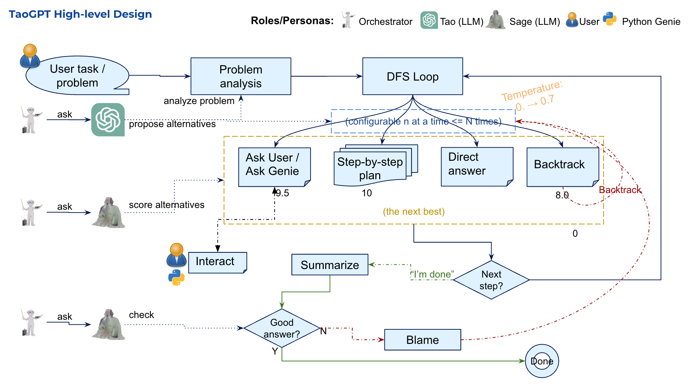
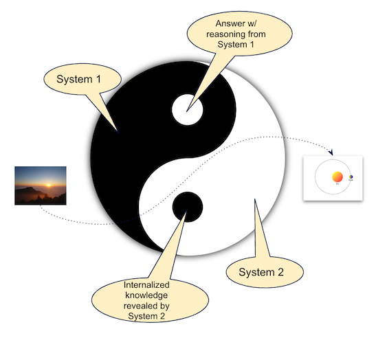

# TaoGPT: Template-guided Autoregressive Orchestrator for General Problem Tackling

<div style="text-align: center">

### A generalized System 1 & 2 hybrid AI agent which incidentally runs on ChatGPT 4


</div>
<div style="text-align: center">


*The Tao gives birth to One. One gives birth to Two. Two gives birth to Three.
Three gives birth to all things. -- Tao Te Ching. (Quote [selected by TaoGPT](examples/gpt-4/taogpt-quote.log.md))*

"Knowing others is wisdom, knowing yourself is Enlightenment." In the dance of problem-solving, be like water—flexible yet persistent, yielding yet powerful. Embrace the Tao of adaptability, yielding to the natural flow of each unique challenge. Respect the intrinsic nature, do not force, do not impose. For the enlightened problem solver, errors are but stepping stones on the path to truth, each misstep an opportunity to backtrack, to learn, to grow. So, like the eternal Tao, the way of problem-solving is not set in stone, but ebbs and flows with the rhythm of wisdom and enlightenment.

-- [Self-pitch by TaoGPT](/examples/gpt-4/taogpt-self-pitch.final.md)

</div>

## Introduction

(*This section [is written by TaoGPT](examples/gpt-4/taogpt-self-describe.log.md) with illustration by the authors.*)



The problem-solving system is a collaborative platform designed to tackle complex problems in a structured and systematic manner. It leverages the unique strengths of three key components: Tao, Orchestrator, and Sage.

Tao is the diligent problem solver in this system. His primary role is to solve problems in a recursive, top-down fashion. He takes one step at a time, ensuring that each step is thoroughly analyzed and solved before moving on to the next. Tao's responsibilities include understanding the problem at hand, breaking it down into manageable steps, and working through each step methodically. He is also responsible for communicating his progress and findings to the Orchestrator and Sage, and for incorporating their feedback into his problem-solving process.

The Orchestrator is the guiding force in this problem-solving system. Its primary role is to provide workflow guidance, ensuring that the problem-solving process is structured and systematic. The Orchestrator's responsibilities include invoking Sage at appropriate times to analyze Tao's problem-solving strategies and solutions. It also manages the interaction between Tao and Sage, ensuring that their collaboration is effective and productive.

Sage is the critic in this problem-solving system. Its primary role is to carefully analyze the problem-solving strategies and solutions proposed by Tao. Sage provides criticism and opinions, helping to refine and improve the problem-solving process. Sage's responsibilities include scrutinizing Tao's problem-solving steps, identifying potential errors or inefficiencies, and providing constructive feedback.

The interaction between Tao, Orchestrator, and Sage is a crucial aspect of this problem-solving system. The Orchestrator manages the interaction between Tao and Sage, invoking Sage at appropriate times to analyze Tao's problem-solving strategies and solutions. Sage scrutinizes Tao's problem-solving steps and provides constructive feedback, which is communicated back to Tao through the Orchestrator, helping Tao to refine his problem-solving process.

This system is designed to facilitate effective problem-solving by breaking down complex problems into manageable steps, encouraging critical analysis, and promoting collaboration.

## Philosophy

AI agent can be categorized into three main types of reasoning systems: System 1 reasoner, System 2 reasoner, and the 
Hybrid reasoner. The System 1 reasoner relies on memorized knowledge, common sense, and intuition, often described 
as the "black arts". Notable examples of this system include neural networks and large language models in particular.

On the other end of the spectrum, we have the System 2 reasoner that employs complex reasoning process. Classic 
cases include the medical diagnosis system MYCIN, logic programming language Prolog and IBM’s DeepBlue chess-playing 
program.

Hybrid reasoning, as the name suggests, is the marriage between the System 1 and System 2 reasoners. In other words, 
it uses search and backtracking guided by intuition. One of the well-known instances of hybrid reasoner is AlphaGo, 
the first AI to beat a human world champion Go player. AlphaGo employs systematic search techniques under the 
guidance of its intuition (developed through learning) to make the best move decisions and judge board situation.

Dynamic duality is a key characteristic of intelligent reasoning in a hybrid system:

* Intuition can produce answers with some (shallow) reasoning steps;
* Intuition generates search branches and ranks them for problems without mechanical branching such as non-board 
  games and most real-world problems;
* Deep search of the System 2 reasoning process extends capability unreachable by intuition;
* Knowledge revealed by searching can be internalized to become intuition through (continuous) learning and memoization;
* Better intuition reduces search cost but never replace searching
* Intuition can decide the halting of a search for problems without mechanical verification such as non-board
  games and most real-world problems.

This philosophy can be depicted in the illustration below. The knowledge that the Earth orbits the Sun is an obvious 
example of transitions between System 1 and 2. Human beings, relying solely on daily intuition, had believed the Sun 
orbited the Earth until Nicolas Copernicus discovered the opposed arrangement, through elaborated reasoning using his 
knowledge and insights of math and astronomy, and confirmed by scientists after him. Today, most human beings have 
the intuitive knowledge that the Earth orbits the Sun, even though few of them can actually perform the same 
elaborated reasonings the pioneering scientists did.



TaoGPT strikes to be a hybrid system that embraces and implements the duality of System 1 and System 2 reasoners.

## Key Features and Methodology

(This is a high-level overview. More details will be presented later.)

### Key features

* One set of generic instruction prompt.
* Top-down recursive step-by-step problem solving. guided by simple templates.
* Flexible problem solving strategy and structure: encourage high-level abstract recursive strategies, but honor
  intuition and do not forbid iterative or out-of-plan steps.
* Fast-tracked backtracking.
* Multiple opportunities to correct errors.

### Technical features

* LLM token usage limiting and optimization to guard against out-of-control token usages.
* Resumable execution (when token limit is reached.)
* Tao can take use of writing Python codes for the purpose of solving the problem (even if the problem's answer does
  not need program codes.) The sandbox environment is known as the Python Genie to Tao.
* File generation support: Tao can generate files as part of the answer and the files are collected
  and saved.
* Multi-LLM support: in order to lower LLM costs, it is possible to configure TaoGPT to use different LLMs for
  different needs during problem solving. For example, one could use gpt-3.5 for Tao while gpt-4 for Sage. Also long
  context LLM can be configured to use when the context length exceeds a certain limit. For example, gpt-4-32k is
  used in place of gpt-4 when the context exceeds 3000 tokens.

### Problem solving process

A problem solving session typically flows like:

1. User's task is presented to Tao
2. Orchestrator asks Tao to first analyze the task problem for issues and contradictions.
3. Orchestrator asks Tao to deliberate, one or more times, to solve the step. (Task problem is the root step.)
4. Tao replies using one of these strategies: answer directly, decompose into a step-by-step plan, interact with the 
   user or environment (e.g. asking clarification questions, executing python codes, etc.,) or give up due to error 
   found.
   1. Tao's response should be in the JSON template required by the Orchestrator. If the response is not in the 
      expected format, the Orchestrator informs Tao of the error and repeat the 
      deliberation for a confiurable number of times.
5. After receiving all deliberated approaches, Orchestrator asks Sage to rank and deduplicate the approaches.
   * Response error identification and correction is similar to step 4.1
6. Orchestrator select the next best approach and take appropriate actions
    * For asking user, present questions to user and solicit answers.
    * If Tao gives up, backtrack and try the next best approach.
    * For step-by-step plan, start with the first step in the plan and go to #3.
    * Else, find out from reply or ask Tao for the next step and go to #3.
7. If Tao's direct answer indicates final answer:
    1. Add a (retryable) summarization step to let Tao summarize the conversation into a final answer
    2. Ask Sage to verify the final answer.
       * Response error identification and correction is similar to step 4.1
    3. If Sage thinks the final answer is incorrect,
        1. ask Sage to identify the steps that cause errors.
        2. backtrack directly to the first problematic step and go to #3.
    4. Else done

### Limitations

* TaoGPT currently works best with GPT-4. While GPT-3.5 is supported, it is found to be not intelligent enough to
  work with the templates and instructions in most cases. Supports for other LLMs can be added in the future.
* Given the lengthy and backtrackable conversations necessary to solve problems, users should be mindful about token
  usages. TaoGPT sets the initial token usage limit to 10,000, check token consumptions at resumable check-points, and
  will ask user to grant more tokens if limit is exceeded.
* Maximum conversation context lengths in most LLMs including GPT-4 are quite low. This hinders TaoGPT's ability to
  work on large problem such as full blown implementation of an application project.

Some of these limitations and costs can be reduced over time as hardward availability, costs and performances improve.

## Examples

(The problem solving logs are markdown format with colored sections. Some Markdown viewers, such as those built in 
the git source control system, may remove `<div>`s used for coloring sections. For best viewing pleasure, it is 
recommended to view the log contents using a proper Markdown browser plugin.)

This a final problem solving chain showing TaoGPT tackling a travel planning task. The steps go through:

1. Analyze the task problem;
2. Ask user some questions for clarification;
3. Propose step-by-step plans;
4. Rank step-by-step plans;
5. Work on the best ranked step-by-step plan to come up with a feasible answer;
6. Optimize the answer;
7. Summary into the final answer;
8. Check the final answer.

Comparing the TaoGPT, GPT-4 with the default system prompt produced
a [generic and vague response](/examples/gpt-4/travel-planning.default.md). The details of execution
log can be found [here](/examples/gpt-4/travel-planning.log.md).

More examples are in the [examples folder](/examples).


<div style="background-color:lightgreen; padding: 5px; border-bottom: 1px dotted grey">
<div>[0] <b>user</b>: </div>

I want to travel to Moscow. Find me a travel route.


</div>

<div style="background-color:lightyellow; padding: 5px; border-bottom: 1px dotted grey">
<div>[1] <b>Tao</b>: </div>

***Problem Analysis***


The problem statement does not contain any fundamental errors, invalid assumptions, or contradictions. However, it lacks specific details that would be necessary to provide a comprehensive solution. For instance, it does not specify the starting location, preferred mode of transportation, budget, or time constraints. These factors can significantly influence the travel route.


</div>

<div style="background-color:lightgreen; padding: 5px; border-bottom: 1px dotted grey">
<div>[2] <b>user</b>: </div>

***Tao asked and user replied:***


> What is your current location? [This will serve as the starting point of your journey.]

Urumuqi

> What is your preferred mode of transport? [Options could be by air, rail, road or sea. This will help in determining the type of route to provide.]

I am afraid of flying

> Do you have any budget constraints for the journey? [This will help to find a route that fits your budget.]

I have a lot of money

> How much time do you have for the travel? [This will help in choosing the fastest or most cost-effective route depending on your time availability.]

I have a lot of times

> Are you okay with transfers or do you prefer a direct route? [This will help in determining the complexity of the route. Some people might prefer a direct flight, while others might not mind taking several flights.]

OK but prefer fewer layovers or changeovers

> Do you want to make any stops along the way? [If there are specific places you want to visit on your way to Moscow, those can be included in the route. This will help in customizing the route to your preferences.]

Chongqing


</div>

<div style="background-color:lightyellow; padding: 5px; border-bottom: 1px dotted grey">
<div>[3] <b>Tao</b>: </div>

***HERE_IS_MY_STEP_BY_STEP_PLAN***


[at step: start working on the problem]

```json
{
  "1": {
    "description": "Identify the starting point, which is Urumuqi"
  },
  "2": {
    "description": "Identify the destination, which is Moscow"
  },
  "3": {
    "description": "Identify the stopover point, which is Chongqing"
  },
  "4": {
    "description": "Find a route from Urumuqi to Chongqing by land or sea, considering the users fear of flying"
  },
  "5": {
    "description": "Find a route from Chongqing to Moscow by land or sea, considering the users fear of flying"
  },
  "6": {
    "description": "Combine the two routes to form a complete travel route from Urumuqi to Moscow via Chongqing"
  }
}
```


</div>

<div style="background-color:lightyellow; padding: 5px; border-bottom: 1px dotted grey">
<div>[4] <b>Tao</b>: </div>

***I_WILL_ANSWER_DIRECTLY***


[at step: Identify the starting point, which is Urumuqi]

The starting point of the journey is Urumuqi.


</div>

<div style="background-color:lightyellow; padding: 5px; border-bottom: 1px dotted grey">
<div>[5] <b>Tao</b>: </div>

***I_WILL_ANSWER_DIRECTLY***


[at step: Identify the destination, which is Moscow]

The destination of the journey is Moscow.


</div>

<div style="background-color:lightyellow; padding: 5px; border-bottom: 1px dotted grey">
<div>[6] <b>Tao</b>: </div>

***I_WILL_ANSWER_DIRECTLY***


[at step: Identify the stopover point, which is Chongqing]

The stopover point of the journey is Chongqing.


</div>

<div style="background-color:lightyellow; padding: 5px; border-bottom: 1px dotted grey">
<div>[7] <b>Tao</b>: </div>

***I_WILL_ANSWER_DIRECTLY***


[at step: Find a route from Urumuqi to Chongqing by land or sea, considering the users fear of flying]

Given the user's fear of flying, the best option would be to travel by train. The journey from Urumuqi to Chongqing by train takes approximately 36 hours. The train route is as follows:

1. Urumuqi to Lanzhou via K978 Train (Approximately 24 hours)
2. Lanzhou to Chongqing via K1069 Train (Approximately 12 hours)

Please note that these are approximate times and can vary. It is recommended to check the train schedules for the most accurate information.


</div>

<div style="background-color:lightyellow; padding: 5px; border-bottom: 1px dotted grey">
<div>[8] <b>Tao</b>: </div>

***I_WILL_ANSWER_DIRECTLY***


[at step: Find a route from Chongqing to Moscow by land or sea, considering the users fear of flying]

Given the user's fear of flying, the best option would be to travel by train. The journey from Chongqing to Moscow by train is quite long and involves several transfers. Here is a possible route:

1. Chongqing to Beijing via G574 Train (Approximately 11 hours)
2. Beijing to Ulaanbaatar, Mongolia via K23 Train (Approximately 30 hours)
3. Ulaanbaatar to Irkutsk, Russia via Train 362 (Approximately 24 hours)
4. Irkutsk to Moscow via Train 002 (Approximately 75 hours)

Please note that these are approximate times and can vary. It is recommended to check the train schedules for the most accurate information.


</div>

<div style="background-color:lightyellow; padding: 5px; border-bottom: 1px dotted grey">
<div>[9] <b>Tao</b>: </div>

***I_WILL_ANSWER_DIRECTLY***


[at step: Combine the two routes to form a complete travel route from Urumuqi to Moscow via Chongqing]

The complete travel route from Urumuqi to Moscow via Chongqing by train is as follows:

1. Urumuqi to Lanzhou via K978 Train (Approximately 24 hours)
2. Lanzhou to Chongqing via K1069 Train (Approximately 12 hours)
3. Chongqing to Beijing via G574 Train (Approximately 11 hours)
4. Beijing to Ulaanbaatar, Mongolia via K23 Train (Approximately 30 hours)
5. Ulaanbaatar to Irkutsk, Russia via Train 362 (Approximately 24 hours)
6. Irkutsk to Moscow via Train 002 (Approximately 75 hours)

Please note that these are approximate times and can vary. It is recommended to check the train schedules for the most accurate information.


</div>

<div style="background-color:lightyellow; padding: 5px; border-bottom: 1px dotted grey">
<div>[10] <b>Tao</b>: </div>

***Tao's Final Answer***


[at step: summarize final answer]

The journey from Urumuqi to Moscow via Chongqing, considering your fear of flying, can be completed by train. Here is your complete travel route:

1. Start in Urumuqi. Take the K978 Train to Lanzhou. This journey will take approximately 24 hours.

2. From Lanzhou, take the K1069 Train to Chongqing. This leg of the journey will take approximately 12 hours.

3. After a stopover in Chongqing, proceed to Beijing via the G574 Train. This journey should take approximately 11 hours.

4. From Beijing, board the K23 Train to Ulaanbaatar, Mongolia. This leg of the trip will take approximately 30 hours.

5. When you reach Ulaanbaatar, take Train 362 to Irkutsk, Russia. This journey will take approximately 24 hours.

6. Finally, from Irkutsk, you will board Train 002 to Moscow. This final leg of the journey will take approximately 75 hours.

Please note that these are approximate journey times and they can vary. It is recommended to check the train schedules closer to your departure date to get the most accurate information.

Safe travels!


</div>


### Comparing to GPT-4 answer using system default prompt

Default prompt: "You're a helpful assistant."

<div style="background-color:lightgreen; padding: 5px; border-bottom: 1px dotted grey">

**user**:

I want to travel to Moscow. Find me a travel route.

</div>

<div style="background-color:lightyellow; padding: 5px; border-bottom: 1px dotted grey">

**gpt-4**:

I'm sorry for the confusion, but I actually can't help with travel routes or booking travel as my current capabilities are limited to mathematical calculations. I recommend using travel websites or applications which can assist in finding the most suitable route and means of travel to Moscow from your current location. They can provide real-time data, cost estimates, different transportation alternatives, and more.

</div>

# Installation

### Install via pip

From local git check-out to path `taogpt`:

```shell
pip install path/to/taogpt/
```

**Sandboxing Python environment**: Tao can execute Python codes as a tool to solve problem. By default, the user will
be prompted before a code snippet is executed. It is highly recommended that TaoGPT be installed in a virtual
machine (docker) for ultimate security.

# Usages

## Command-line interface

To show help:

```shell
taogpt --help
```

Example command-line invocation with a simple arithmetic problem:

```shell
export OPENAI_API_KEY="...your OpenAI key..."
export OPENAI_API_BASE="https://api.openai.com/v1" # or you OPENAI_API_BASE URL
mkdir /tmp/taogpt_outputs # directory where output files go to.
taogpt -p /tmp/taogpt_outputs "What's x mod (y - z) where x = 10, y = 7, z = 4."
```

The command-line tool will print out (abbreviated) log in the console. A file logging the problem solving
progress and a file with the final step chain are written to the output directory; they are Markdown files viewable
by any Markdown viewer. Users are recommended to view the Markdown log files for better experiences. The directory also
contain any Tao-generated files organized by directory paths.

```shell
mkdir /tmp/taogpt_outputs # directory where output files go to.
taogpt -p /tmp/taogpt_outputs "I plan to relocate to San Francisco Bay Area next month. Where should I settle?"
```

## Web UI interface

*TBA*

## Inspirations

Formal citations will be provided with pending publications. Here are some prior arts inspiring TaoGPT:

* Chain of Thought
* ReACT
* Tree of Thoughts
* Graph of Thoughts
* ToolLLM

# Publications

*Pending*

# License

The Responsible Artificial Intelligence Source Code License, Version 11

# Citation

Please consider citing our work if you use the data or code in this repo.

```
@software{taogpt,
  title = {TaoGPT},
  author = {Quock, Winston},
  url = {https://github.com/TBD/TaoGPT},
  version = {pre-release},
  year = {2023},
  month = {10},
}
```
